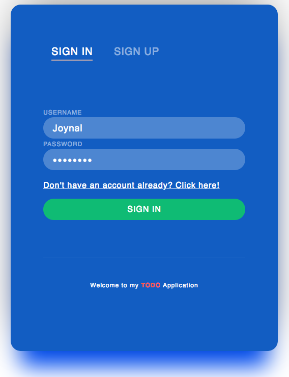

**NOTE**: You can see a live version of this app by visiting my website at <a href="http://todo.joynal.me" target="_blank">http://todo.joynal.me</a>

# Simple TO-DO App

**Warm-Up Exercise** for senior project class.
This is a complete full-stack application which uses following latest technologies: Node.js, Express.js, AngularJS, and MongoDB.



<!--  -->


## Getting Started

These instructions will get you a copy of the project up and running on your local machine for development and testing purposes.

### Prerequisites []()

What things you need to install the software and how to install them

| Software    | Version     |
| ----------- | ---------------- |
| `NODE.JS`   | [`v8.9.4 or above`](https://nodejs.org/en/download/)|

You can click on the `v8.9.4` or visit nodejs official website to download nodejs on your computer.

Once downloaded, make sure it's installed by typing `node --version` on your terminal. If you see a version is printed that is `v8.9.4` or above, you can move on to the next step.

### Installing

A step by step series of examples that tell you how to get a development env running

clone this repo:

```
$ git clone https://github.com/Joy57/todo.git
```

You'll have a folder named `todo-app`. 

Type the following command:
```
cd todo-app
```
Now install all the dependency by running this:

```
npm install
```
You can now get the app server up and running by typing `node app.js`. It's that simple!

Visit `http::/localhost:3000` to checkout the app

### Database

Make sure to connect to your own database
by changing line 35 [mongoose.connect] `mongodb://localhost/tododatabase`


## Running the tests

Before running the test make sure you have a chrome webdriver installed already on your system.

If you do not have a chrome driver installed. Type the following:
```
npm install chrome -g
```

Now, run the automated tests by typing `node test/test_app.js` 

Following are the 5 test cases as of right now:

1. Register New Account
2. Login with valid credentials
3. Add a new todo item to the list
4. Delete item from the list
5. Logout functionality

[](https://travis-ci.org/)

--------------
#### Author
###### Joynal Abedin


